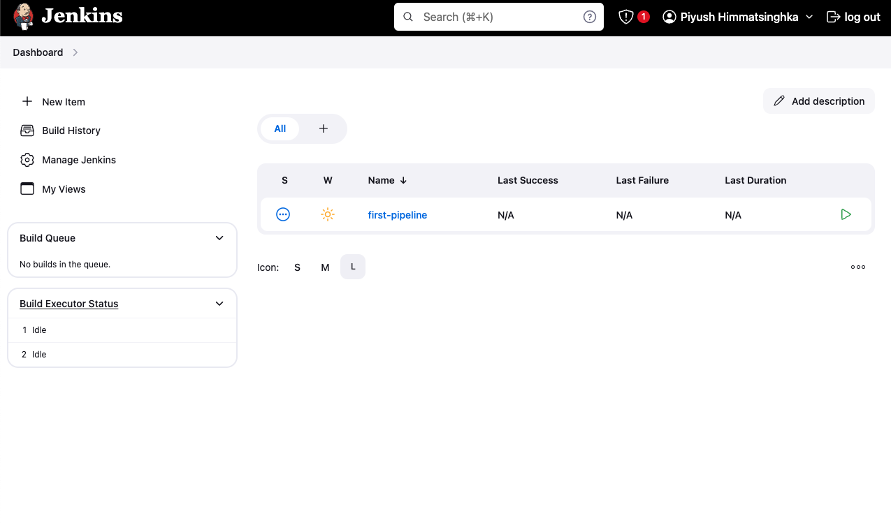

# Jenkins Installation and Setup

This guide walks you through installing and setting up Jenkins on an Ubuntu system using a setup script.

## Prerequisites

Before you begin, ensure that your system meets the following requirements:

- **Operating System:** Ubuntu 20.04 or later
- **Memory:** At least 2 GB of RAM
- **Java Version:** Java 17 Runtime Environment (installed via this script)

## Installation Steps

### 1. Run the Setup Script

Execute the `setup.sh` script to automate the installation of Jenkins:

```bash
chmod +x setup.sh
./setup.sh
```

This script will:

- Update and upgrade your system packages.
- Install Java 17 Runtime Environment.
- Add the Jenkins GPG key and repository.
- Install Jenkins.
- Enable the Jenkins service to start on boot.
- Start Jenkins and check its status.

### 2. Access Jenkins

After running the script, Jenkins should be up and running. You can access the Jenkins web interface by navigating to the following URL in your web browser:

```
http://your-server-ip:8080
```

Replace `your-server-ip` with your server's actual IP address.

### 3. Unlock Jenkins

To unlock Jenkins, you need to retrieve the initial admin password. Run the following command:

```bash
sudo cat /var/lib/jenkins/secrets/initialAdminPassword
```

Copy the password and paste it into the "Administrator password" field on the Jenkins setup page.


### 4. Customize Jenkins

After unlocking Jenkins, you will be prompted to customize your Jenkins setup:

- **Install Suggested Plugins:** Choose this option for a quick setup.
- **Create Admin User:** Provide details to create your first admin user.


### 5. Verify Jenkins Installation

Once Jenkins is set up, you should see the Jenkins dashboard:



From here, you can start creating jobs, managing plugins, and configuring Jenkins according to your needs.
